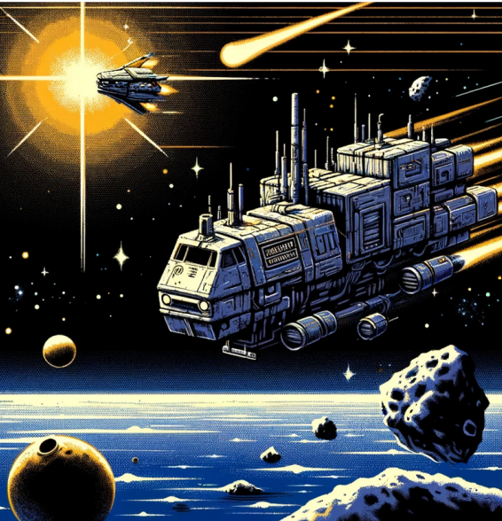
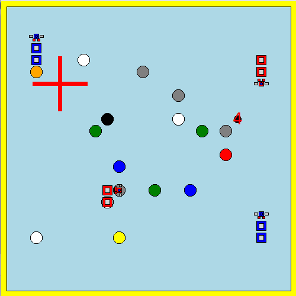

[![Contributors][contributors-shield]][contributors-url]
[![Forks][forks-shield]][forks-url]
</br>
[![Stargazers][stars-shield]][stars-url]
[![Issues][issues-shield]][issues-url]
</br>
[![Oz][oz-shield]][oz-url]

<div align="center">
  <a href="https://github.com/Woodyy07/LethOz.git">
    
  </a>

<h1 align="center">LethOz</h1>

<p align="center">LethOz is a coding school project developed in a functional programming language Oz. It consists of a "snake like" game with bonuses/maluses, multiplayer and low graphics !</p>

<p align="center">
    <a href="https://github.com/Woodyy07/LethOz.git">View Docs</a>
    ·
    <a href="https://github.com/Woodyy07/LethOz/issues">Report Bug</a>
    ·
    <a href="https://github.com/Woodyy07/LethOz/issues">Request Feature</a>
</p>
</div>

## Navigation

- [Navigation](#navigation)
- [About the Project](#about-the-project)
- [Getting Started](#getting-started)
  - [Prerequisites](#prerequisites)
  - [Installation](#installation)
  - [Usage](#usage)
- [Contribution](#contribution)
  - [Roadmap](#roadmap)
  - [Changelog](#changelog)
- [Contact](#contact)
- [Help](#help)
- [Acknowledgments](#acknowledgments)

---

## About the Project

<div align="center">
  
</div>

LethOz is an exciting coding school project developed in a functional programming language Oz. This project features a multiplayer space-themed game reminiscent of the classic snake game, offering a unique twist with bonuses and maluses !
Players navigate through space, collecting bonuses to enhance their gameplay while avoiding maluses that can hinder their progress. Dive into the world of LethOz for a fun and challenging gaming experience that showcases the power of functional programming in creating engaging and interactive projects.

## Getting Started

### Prerequisites

In order to build Mozart 2 (Oz), you need the following tools on your computer

- git and Subversion to grab the source code
- java >= 1.6.0
- gcc >= 4.7.1 on Windows, Linux and Mac OS < 10.8;
- cmake >= 2.8.6
- Boost >= 1.53.0 (with development files). We recommend the use of Boost 1.65 as there is some issues with recent version of Boost with cmake.
- Tcl/Tk 8.5 or 8.6 (with development files)
- Emacs

### Installation

As the Mozart repository contains submodules, you should clone recursively

```sh
git clone --recursive https://github.com/mozart/mozart2
```

You can also fetch the submodules separately using

```sh
git clone https://github.com/mozart/mozart2
cd mozart2
git submodule update --init
```

Mozart 2 is built with cmake. The following steps will perform the build and the installation

```sh
mkdir build
cd build
cmake -DCMAKE_BUILD_TYPE=Release ..
make
make install
```

This can take some time ... sit down and relax !

### Usage

1. Enter the code.oz file
2. At the end of the file, you can access the "Options" part of the code
3. Choose which scenario you want to play with (No UI for this project ...)
4. Right-click anywhere in the code file
5. Click on "Feed File"
6. Wait for the code to be accepted by the compiler
7. A new window should open with the game !

If you want to modify the library to change the games parameters, you can run the following command

```sh
LethOzLib.ozf: project_library.oz
  ozc -o $@ -c $<
```

## Contribution

If you have a suggestion that would make this better, please see the [open issues](https://github.com/Woodyy07/LethOz/issues) for a full list of proposed features (and known issues) !

1. Fork the Project
2. Create your Feature Branch (`git checkout -b feature/AmazingFeature`)
3. Commit your Changes (`git commit -m 'Add some AmazingFeature'`)
4. Push to the Branch (`git push origin feature/AmazingFeature`)
5. Open a Pull Request

### Roadmap

- [x] Test movements
  - [x] Implement DecodeStrategy
  - [x] Implement Next
  - [x] Implement movements
- [x] Test basics effects
  - [x] Implement effect "scrap"
  - [x] Implement effect "wormhole"
  - [x] Implement effect "revert"
- [x] Test all effects
  - [x] Implement effect "malware"
  - [x] Implement effect "shrink"
  - [x] Implement absorbant boundaries
  - [x] Implement effect "emb"
- [x] Test final (Scenario.oz)

### Changelog

- 0.1
  - Initial Release

## Contact

GitHub : [Woody](https://github.com/Woodyy07)

## Help

If you have any issue with this project, please [report it here](https://github.com/Woodyy07/LethOz/issues) !

## Acknowledgments

Thanks to [Othneil Drew's README Template](https://github.com/othneildrew/Best-README-Template.git) !

<!-- MARKDOWN LINKS & IMAGES -->

[contributors-shield]: https://img.shields.io/github/contributors/Woodyy07/LethOz.svg?style=for-the-badge
[contributors-url]: https://github.com/Woodyy07/LethOz.git/graphs/contributors
[forks-shield]: https://img.shields.io/github/forks/Woodyy07/LethOz.svg?style=for-the-badge
[forks-url]: https://github.com/Woodyy07/LethOz.git/network/members
[stars-shield]: https://img.shields.io/github/stars/Woodyy07/LethOz.svg?style=for-the-badge
[stars-url]: https://github.com/Woodyy07/LethOz.git/stargazers
[issues-shield]: https://img.shields.io/github/issues/Woodyy07/LethOz.svg?style=for-the-badge
[issues-url]: https://github.com/Woodyy07/LethOz.git/issues
[oz-shield]: https://img.shields.io/badge/Oz-yellow?style=for-the-badge&logo=oz&logoColor=white
[oz-url]: http://mozart2.org
